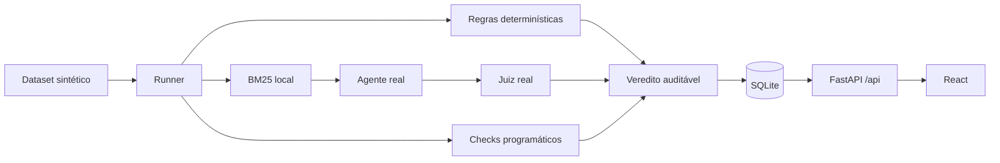

<p align="center">
  
</p>

> **Jev e LLM como juiz, sobre a mesma resposta.** Compare decisões, qualidade, latência, tokens e custos — com racional do LLM e ausência de racional do Jev claramente identificados.
>
> **Problema:** decidir e gerar texto são capacidades diferentes. Um score sem metodologia não basta para escolher um avaliador.
>
> **Versão 1.1.0:** 4 métodos, benchmark pareado com 24 casos e 48 respostas fixas, três repetições, histórico SQLite e quatro protocolos de auditoria.

Harness local para executar avaliações de agentes e entender, em linguagem direta, por que cada resposta passou, falhou ou ficou inconclusiva.

## Comece localmente

Você não precisa de API key para conhecer o produto:

```bash
docker compose up -d --build
```

Abra <http://127.0.0.1:8000>. O serviço é publicado somente no loopback local.

### Percurso de cinco minutos, sem chave e sem custo

1. Em **Comece aqui**, escolha **Aprender com uma demonstração local**.
2. Execute **Exemplo aprovado**. O backend recebe “Brasília”, aplica a regra exata e persiste o veredito.
3. Execute **Exemplo reprovado**. Compare esperado, observado e justificativa.
4. Abra **Auditoria de viés** e execute o experimento local sobre definição de correto.
5. Em **Comparar juízes**, explore o exemplo real registrado, sem consumir créditos.
6. Compare a regra exata com a regra que aceita aliases. O resultado mostra sensibilidade à regra, não prevalência geral de viés.

As duas respostas da demonstração são `supplied_trace`: foram fornecidas pelo projeto e avaliadas pelo motor real. A interface nunca afirma que uma IA as gerou.

## Executar com modelos reais

Copie a configuração e preencha somente as chaves dos providers que pretende usar:

```bash
cp .env.example .env
```

O fluxo padrão usa:

| Papel | Configuração padrão | Necessário para |
|---|---|---|
| `agent` | OpenAI | Gerar respostas e self-preference |
| `judge` | GPT-4.1 mini · OpenAI direta | Juiz principal e benchmark pareado |
| `judge_alt` | Gemini · Google direto | Juiz alternativo e auditorias existentes |
| `decision_model` | Jev 1.13 · OpenRouter Decisions | Probabilidade de atender ao critério, sem racional textual |

Recrie o serviço depois de alterar `.env`:

```bash
docker compose up -d --build
```

Em **Avaliações → Execução com IA real**, escolha um caso. Escolha o juiz LLM e, opcionalmente, inclua Jev. Antes de iniciar, a tela mostra providers necessários, três tentativas, número total de chamadas e perfil de custo. A execução só começa após confirmação explícita.

Não existe retry ou fallback automático. Timeout, indisponibilidade e falha parcial ficam preservados como evidência inconclusiva.

## Comparar Jev e LLM como juiz

Em **Comparar juízes**, abra o resultado histórico incluído ou escolha **Nova comparação**.
Um caso faz 12 chamadas; a suíte completa faz 288: 24 casos × duas respostas × três repetições × dois juízes.
O orçamento por execução é limitado a 300 chamadas e US$ 2, somando OpenAI e OpenRouter.

```dotenv
OPENAI_API_KEY=...
OPENROUTER_API_KEY=...
JEV_API_KEY=                 # opcional; vazio reutiliza OPENROUTER_API_KEY
JEV_BASE_URL=https://openrouter.ai/api/alpha/decisions
JEV_MODEL=typesafe/jev-1.13
EVAL_JUDGE_PROVIDER=openai
EVAL_JUDGE_MODEL=gpt-4.1-mini
```

OpenRouter é usado para Jev neste protocolo; GPT-4.1 mini acessa a OpenAI diretamente.
Gemini continua disponível pelo Google. As configurações antigas de outros providers permanecem compatíveis.

| | LLM como juiz | Jev |
|---|---|---|
| Retorno | JSON com nota, decisão, razão e evidências | Probabilidade `answers.passed.noul` |
| Significado do score | Nota da rubrica; não é probabilidade calibrada | Probabilidade da pergunta binária |
| Racional | Texto gerado, que também pode errar | Não fornecido; a razão exibida descreve apenas o corte aplicado |
| Custo | Informado se disponível; senão estimativa identificada pelo catálogo, incluindo cache | Informado pelo OpenRouter; senão estimativa identificada quando há usage e tarifa |
| Contexto | Pergunta, referência, critério, rubrica, fontes e resposta com traces | Mesmo conteúdo avaliável |

**Sem racional textual não significa zero tokens de saída:** o usage da API Jev pode contabilizá-los.
Os valores retornados são preservados. Latência inclui cliente, rede e serviço, com a espera por concorrência separada.
Não representa uma medição isolada da velocidade de cada modelo.

Os nove casos com limiar **1,0** foram preservados: Jev com probabilidade **0,99 reprova**.
A análise de sensibilidade usa apenas os scores já salvos, sem novas chamadas nem alteração do histórico.
Concordância não prova correção, e três repetições não criam três amostras independentes.

O benchmark não mede viés, resistência a prompt injection ou generalização. As auditorias existentes têm seus próprios modelos e protocolos; seus resultados não são atribuídos ao Jev.
Veja [o protocolo reproduzível e os limites](docs/benchmark.md).

### API

Os endpoints existentes continuam disponíveis. Em `POST /api/eval/run` e `POST /api/eval/sessions`, inclua `"decision_model"` na lista `methods` para avaliar a mesma resposta com os dois juízes.
Uma falha operacional não apaga o outro julgamento; sem reprovação conhecida, um juiz obrigatório ausente impede aprovação conclusiva.

| Método e rota | Função |
|---|---|
| `GET /api/eval/benchmarks/preflight` | Prontidão, catálogo e limites, sem inferência paga |
| `GET /api/eval/benchmarks/samples` | Candidatos, referências e rótulos sintéticos |
| `POST /api/eval/benchmarks` | Criar: `{"confirm_paid":true,"max_calls":300,"max_cost_usd":2}`; `case_ids` opcional |
| `GET /api/eval/benchmarks` | Histórico paginado |
| `GET /api/eval/benchmarks/{id}` | Snapshot com amostras, resultados e reservas |
| `GET /api/eval/benchmarks/{id}/summary` | Estatísticas; `?threshold=0.8` é exploratório |
| `GET /api/eval/benchmarks/{id}/events` | Eventos SSE e snapshots |
| `POST /api/eval/benchmarks/{id}/cancel` | Interromper execução; consumo incerto continua reservado |
| `GET /api/eval/benchmarks/example` | Evidência histórica incluída, identificada como registrada |

OpenAPI completo em `/docs`. O benchmark é independente da geração live; não gera novamente as respostas do agente.

## Como interpretar os resultados

| Resultado | Significado |
|---|---|
| Aprovado | Todos os critérios normativos disponíveis foram atendidos. |
| Reprovado | Pelo menos um critério normativo falhou. |
| Instável | As três tentativas produziram vereditos diferentes. |
| Inconclusivo | Faltou evidência, uma tentativa falhou ou um provider foi interrompido. |

Uma reprovação do conteúdo não é erro de infraestrutura. Quando métodos discordam, a UI mostra cada decisão e explica que qualquer falha normativa reprova a tentativa.

## Auditoria de viés

| Pergunta | Protocolo | Chamadas externas |
|---|---|---:|
| A regra muda o resultado? | Compara `tool_exact` e `tool_canonical` no mesmo trace | 0 |
| A ordem muda a avaliação? | Três comparações A/B e três B/A | 6 |
| Texto longo recebe vantagem? | Compara versões concisa e expandida nas duas ordens | 6 |
| O modelo prefere sua família? | Geração e julgamento cruzados entre duas famílias | 18 |

`detected`, `not_detected` e `inconclusive` descrevem somente aquele protocolo, caso, modelos e momento. A UI mostra hipótese, medições e limitações antes do JSON técnico.

## O que está implementado

- Dataset sintético v2 com 24 casos: factual, busca de contexto e uso de ferramenta.
- Match determinístico, checks programáticos, LLM-as-judge e decision model Jev.
- Comparação com matriz de confusão, precisão, recall, F1, consistência, mediana/p95, custos separados, Brier e confiabilidade do Jev.
- Benchmark com reserva de orçamento, eventos, cancelamento e recuperação conservadora após reinício.
- Três tentativas por caso e agregação explícita de estabilidade.
- BM25 local, streaming SSE, métricas, custo com origem e histórico SQLite.
- Importação JSONL sintética, execução de suíte e resumo de sessão.
- Quatro protocolos controlados de auditoria.
- React/Vite servido pelo FastAPI em um único runtime.

## Arquitetura



O projeto é um monólito local sem autenticação ou tenancy. Não exponha o serviço publicamente.

## Desenvolvimento e validação

```bash
uv sync --dev
npm --prefix frontend ci
npm --prefix frontend run build
uv run uvicorn src.main:app --reload
```

Gates offline:

```bash
uv run pytest tests/ -m "not live" -v
uv run ruff check src tests
uv run mypy src
npm --prefix frontend test
npm --prefix frontend run typecheck
npm --prefix frontend run build
npm --prefix frontend run e2e
```

O Playwright padrão sobe a aplicação na porta `8010`, usa um SQLite temporário e zera as chaves no processo do teste. Portanto, não chama providers externos.

Smokes live só rodam com autorização explícita e podem gerar custo:

```bash
RUN_LIVE_LLM_TESTS=1 uv run pytest tests/test_llm_live.py -v
RUN_LIVE_UI=1 npm --prefix frontend run e2e -- --grep "três tentativas reais"
```

## Segurança e limites

- Chaves ficam em `.env`, ignorado pelo projeto, e não são serializadas por `/api/models`.
- Dados, banco de demonstração e casos são sintéticos.
- Custos desconhecidos permanecem `null`; valores de catálogo são identificados como estimativa.
- SQLite oferece persistência local, não escrita distribuída.
- Self-preference exige duas famílias e equivalência factual; indisponibilidade de qualquer provider pode tornar o resultado inconclusivo.
- Migrações são aditivas e idempotentes; resultados da 1.0.0 continuam legíveis. Métricas novas ausentes aparecem como não registradas.
