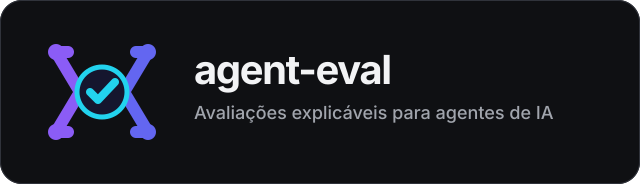
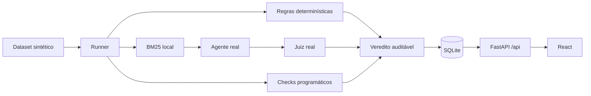

<p align="center">
  
</p>

> **Avaliação de agentes de IA sem caixa-preta.** Um harness que mostra *por que* cada resposta passou, falhou ou ficou inconclusiva, com o racional exposto na interface.
>
> **Problema:** avaliação invisível é avaliação inútil. LLM-as-judge sozinho esconde o critério e o viés.
>
> **Prova:** 3 métodos (determinístico, programático, LLM-as-judge) + 4 protocolos de auditoria de viés + 4 estados de veredito, em 24 casos sintéticos.

Harness local para executar avaliações de agentes e entender, em linguagem direta, por que cada resposta passou, falhou ou ficou inconclusiva.

## Comece em dois comandos

Você não precisa de API key para conhecer o produto:

```bash
docker compose up -d --build
```

Abra <http://127.0.0.1:8000>. O serviço é publicado somente no loopback local.

### Percurso de cinco minutos, sem chave e sem custo

1. Em **Comece aqui**, escolha **Aprender com uma demonstração local**.
2. Execute **Exemplo aprovado**. O backend recebe “Brasília”, aplica a regra exata e persiste o veredito.
3. Execute **Exemplo reprovado**. Compare esperado, observado e justificativa.
4. Abra **Auditoria de viés** e execute o experimento local sobre definição de correto.
5. Compare a regra exata com a regra que aceita aliases. O resultado mostra sensibilidade à regra, não prevalência geral de viés.

As duas respostas da demonstração são `supplied_trace`: foram fornecidas pelo projeto e avaliadas pelo motor real. A interface nunca afirma que uma IA as gerou.

## Executar com modelos reais

Copie a configuração e preencha somente as chaves dos providers que pretende usar:

```bash
cp .env.example .env
```

O fluxo padrão usa:

| Papel | Configuração padrão | Necessário para |
|---|---|---|
| `agent` | OpenAI | Gerar respostas e self-preference |
| `judge` | OpenAI | Comparação da própria família em self-preference |
| `judge_alt` | Gemini | Julgar runs, posição, verbosidade e self-preference |

Recrie o serviço depois de alterar `.env`:

```bash
docker compose up -d --build
```

Em **Avaliações → Execução com IA real**, escolha um caso. Antes de iniciar, a tela mostra providers necessários, três tentativas, número total de chamadas e perfil de custo. A execução só começa após confirmação explícita.

Não existe retry ou fallback automático. Timeout, indisponibilidade e falha parcial ficam preservados como evidência inconclusiva.

## Como interpretar os resultados

| Resultado | Significado |
|---|---|
| Aprovado | Todos os critérios normativos disponíveis foram atendidos. |
| Reprovado | Pelo menos um critério normativo falhou. |
| Instável | As três tentativas produziram vereditos diferentes. |
| Inconclusivo | Faltou evidência, uma tentativa falhou ou um provider foi interrompido. |

Uma reprovação do conteúdo não é erro de infraestrutura. Quando métodos discordam, a UI mostra cada decisão e explica que qualquer falha normativa reprova a tentativa.

## Auditoria de viés

| Pergunta | Protocolo | Chamadas externas |
|---|---|---:|
| A regra muda o resultado? | Compara `tool_exact` e `tool_canonical` no mesmo trace | 0 |
| A ordem muda a avaliação? | Três comparações A/B e três B/A | 6 |
| Texto longo recebe vantagem? | Compara versões concisa e expandida nas duas ordens | 6 |
| O modelo prefere sua família? | Geração e julgamento cruzados entre duas famílias | 18 |

`detected`, `not_detected` e `inconclusive` descrevem somente aquele protocolo, caso, modelos e momento. A UI mostra hipótese, medições e limitações antes do JSON técnico.

## O que está implementado

- Dataset sintético v2 com 24 casos: factual, busca de contexto e uso de ferramenta.
- Match determinístico, checks programáticos e LLM-as-judge.
- Três tentativas por caso e agregação explícita de estabilidade.
- BM25 local, streaming SSE, métricas, custo com origem e histórico SQLite.
- Importação JSONL sintética, execução de suíte e resumo de sessão.
- Quatro protocolos controlados de auditoria.
- React/Vite servido pelo FastAPI em um único runtime.

## Arquitetura



O projeto é um monólito local sem autenticação ou tenancy. Não exponha o serviço publicamente.

## Desenvolvimento e validação

```bash
uv sync --dev
npm --prefix frontend ci
npm --prefix frontend run build
uv run uvicorn src.main:app --reload
```

Gates offline:

```bash
uv run pytest tests/ -v
uv run ruff check src tests
uv run mypy src
npm --prefix frontend test
npm --prefix frontend run typecheck
npm --prefix frontend run build
npm --prefix frontend run e2e
```

O Playwright padrão sobe a aplicação na porta `8010`, usa um SQLite temporário e zera as chaves no processo do teste. Portanto, não chama providers externos.

Smokes live só rodam com autorização explícita e podem gerar custo:

```bash
RUN_LIVE_LLM_TESTS=1 uv run pytest tests/test_llm_live.py -v
RUN_LIVE_UI=1 npm --prefix frontend run e2e -- --grep "três tentativas reais"
```

## Segurança e limites

- Chaves ficam em `.env`, ignorado pelo projeto, e não são serializadas por `/api/models`.
- Dados, banco de demonstração e casos são sintéticos.
- Custos desconhecidos permanecem `null`; valores de catálogo são identificados como estimativa.
- SQLite oferece persistência local, não escrita distribuída.
- Self-preference exige duas famílias e equivalência factual; indisponibilidade de qualquer provider pode tornar o resultado inconclusivo.
- O diretório não foi inicializado como repositório Git; nenhum commit é presumido por esta documentação.
